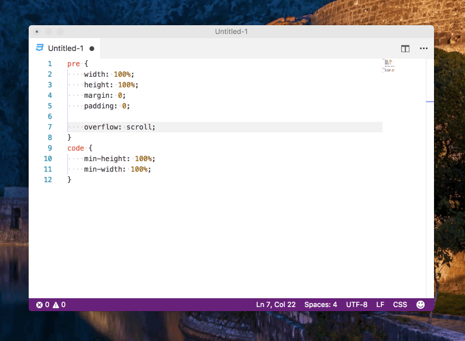

# cerebro-snippets 

> [Cerebro](https://www.cerebroapp.com) plugin to create snippets

## Usage

In Cerebro, type one of the following commands:

- `snip style` - search snippet called style, selecting a snippet will copy the content to the clipboard
- `snipc test` - create snippet called "test"
- `snipd test` - delete snippet

## Settings

You can disable the keyword `snip` for instant searching by typing `plugins snippets` and click on `settings`

## Syntax highlighting

Creating a snippet with a file extension will add syntax highlighting for that snippet: `snipc style.css`

## Related

- [Cerebro](https://github.com/cerebroapp/cerebro) - main repo for Cerebro app
- [Highlight.js](https://highlightjs.org/)
- [React-highlight](https://github.com/akiran/react-highlight)

## License

[MIT © Puyt](LICENSE)
